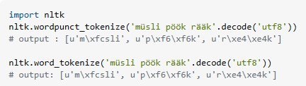
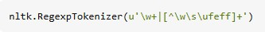

# Atividade 1: [Tokenizing unicode using nltk](https://stackoverflow.com/questions/9228202/tokenizing-unicode-using-nltk)

**Disciplina:** Processamento de Linguagem Natural  
**Instituição:** Universidade Federal de Sergipe

## Equipe

- José Batista
- Carlos Melo
- Roberdan Tamyr
- Arthur Matheus

## Sumário

- [1. Introdução](#1-introdução)
- [2. Análise do Problema](#2-análise-do-problema)
  - [2.1. Configuração do Ambiente](#21-configuração-do-ambiente)
  - [2.2. Reprodução do Erro](#22-reprodução-do-erro)
- [3. Aplicação da Solução Proposta](#3-aplicação-da-solução-proposta)
- [4. Análise da Solução](#4-análise-da-solução)
- [5. Análise de Soluções não aceitas](#5-análise-de-soluções-não-aceitas)
  - [5.1. Certificar está passando string Unicode para o tokenizador](#51certificar-está-passando-string-unicode-para-o-tokenizador)
  - [5.2. Problema na tokenização](#52problema-na-tokenização)
- [6. Conclusão](#6-conclusão)
- [7. Referências](#7-referências)
- [8. Repositório](#8-repositório)
- [9. Vídeo](#9-vídeo)
- [10. Participação](#10-participação)

---

## 1\. Introdução

Este documento apresenta um tutorial detalhado para a resolução de um problema específico em Processamento de Linguagem Natural (PLN): a tokenização incorreta de textos devido à presença do Byte Order Mark (BOM) ao ler arquivos. A atividade baseia-se na análise de um cenário comum ao lidar com diferentes codificações de arquivo, como `utf-8-sig`.

O objetivo é descrever o problema, reproduzi-lo em um ambiente de desenvolvimento Python utilizando a biblioteca NLTK, aplicar uma solução eficaz utilizando o módulo `codecs` e justificar a escolha dessa solução.

O problema central abordado é como o tokenizador `nltk.word_tokenize` pode incluir o caractere BOM (`\ufeff`) como parte do primeiro token se o arquivo não for lido de maneira a remover ou interpretar corretamente este caractere. Este cenário é comum quando arquivos de texto são salvos com a codificação `utf-8-sig`, que prefixa o conteúdo com um BOM.

---

## 2\. Análise do Problema

O problema central ocorre quando um arquivo de texto é salvo com a codificação `utf-8-sig`. Essa codificação adiciona um caractere especial invisível, o Byte Order Mark (BOM), no início do arquivo. Se o arquivo for lido posteriormente usando uma função padrão de abertura de arquivo (como `open()`) com a codificação `utf-8` (que não remove automaticamente o BOM), o BOM (`\ufeff`) torna-se parte da string de texto lida.

Consequentemente, ao usar o `nltk.word_tokenize` para tokenizar esse texto, o primeiro token incluirá o BOM, levando a resultados de tokenização incorretos. Por exemplo, uma palavra como "müsli" precedida pelo BOM seria tokenizada como `'\ufeffmüsli'` em vez de `'müsli'`.

Isso resulta em:

1.  **Primeiro token contaminado:** O primeiro token do texto contém o prefixo BOM, o que pode interferir em etapas subsequentes do processamento de PLN, como busca em vocabulários, stemming ou lematização.
2.  **Inconsistência de dados:** Se alguns textos tiverem BOM e outros não, isso pode levar a inconsistências no corpus processado.

### 2.1. Configuração do Ambiente

Para reproduzir o cenário, é necessário um ambiente Python com a biblioteca NLTK instalada.

**Passo 1: Instalar o NLTK**

```bash
pip install nltk
```

**Passo 2: Baixar o pacote de dados 'punkt'**
O `punkt` é utilizado pelo tokenizador `word_tokenize` do NLTK.

```python
import nltk
nltk.download('punkt')
```

### 2.2. Reprodução do Erro

O script a seguir demonstra o comportamento incorreto do tokenizador `nltk.word_tokenize` quando o texto é lido de um arquivo salvo com `utf-8-sig` usando a função `open()` padrão com `encoding='utf-8'`.

**Código (`problema.py`):**

```python
import nltk
import os

# Texto de exemplo com caracteres Unicode
texto_original = "müsli pöök rääk"
nome_arquivo = 'text_bom.txt'

# Passo 1: Salvar o texto em um arquivo com encoding 'utf-8-sig' (que adiciona BOM)
with open(nome_arquivo, 'w', encoding='utf-8-sig') as f:
    f.write(texto_original)

# Passo 2: Ler o texto do arquivo usando open() padrão com 'utf-8'
# Esta forma de leitura não remove o BOM
with open(nome_arquivo, 'r', encoding='utf-8') as f:
    texto_lido_com_bom = f.read()

print(f"Texto lido (com BOM no início): {repr(texto_lido_com_bom)}")

# Passo 3: Tokenizar o texto lido
tokens_incorretos = nltk.word_tokenize(texto_lido_com_bom)

print("\nResultado da tokenização com NLTK (incorreto):")
print(tokens_incorretos)

# Limpar o arquivo criado
if os.path.exists(nome_arquivo):
    os.remove(nome_arquivo)
```

**Saída Esperada do Código:**


**Análise da Saída Incorreta:**
A saída `['\ufeffmüsli', 'pöök', 'rääk']` demonstra claramente a falha. O primeiro token, "müsli", está prefixado com o caractere BOM `\ufeff`. Isso ocorre porque a leitura padrão do arquivo com `encoding='utf-8'` não lidou com o BOM introduzido pela escrita com `encoding='utf-8-sig'`.

---

## 3\. Aplicação da Solução Proposta

A solução eficaz para este problema é utilizar a função `codecs.open()` do módulo `codecs` com a especificação de encoding `'utf-8-sig'` ao ler o arquivo. Esta combinação garante que o BOM seja corretamente identificado e consumido (removido) durante o processo de leitura, antes que o texto seja passado para o tokenizador.

**Código (`solucao.py`):**

```python
import nltk
import codecs # Importar o módulo codecs
import os

# Texto de exemplo com caracteres Unicode
texto_original = "müsli pöök rääk"
nome_arquivo = 'text_bom_solucao.txt'

# Passo 1: Salvar o texto em um arquivo com encoding 'utf-8-sig' (que adiciona BOM)
# (Mesmo procedimento de escrita que causou o problema)
with open(nome_arquivo, 'w', encoding='utf-8-sig') as f:
    f.write(texto_original)

# Passo 2: Ler o texto do arquivo usando codecs.open() com 'utf-8-sig'
# Esta forma de leitura lida corretamente com o BOM
with codecs.open(nome_arquivo, 'r', encoding='utf-8-sig') as f:
    texto_lido_corretamente = f.read()

print(f"Texto lido (sem BOM no início): {repr(texto_lido_corretamente)}")

# Passo 3: Tokenizar o texto lido corretamente
tokens_corretos = nltk.word_tokenize(texto_lido_corretamente)

print("\nResultado da tokenização com NLTK (correto):")
print(tokens_corretos)

# Limpar o arquivo criado
if os.path.exists(nome_arquivo):
    os.remove(nome_arquivo)
```

**Saída Esperada do Código Corrigido:**


**Análise da Saída Correta:**
A saída agora é `['müsli', 'pöök', 'rääk']`. O primeiro token está correto, sem o prefixo BOM. Isso demonstra que ler o arquivo utilizando `codecs.open(..., encoding='utf-8-sig')` resolve o problema de forma limpa e eficiente, fornecendo ao tokenizador um texto limpo.

---

## 4\. Análise da Solução

A solução que utiliza `codecs.open()` com `encoding='utf-8-sig'` é a mais apropriada para este cenário específico por diversos motivos:

- **Tratamento Específico do BOM:** A codificação `'utf-8-sig'` é projetada para, na leitura, identificar e remover o BOM UTF-8. Na escrita, ela adiciona o BOM. Usá-la na leitura de arquivos que podem ter sido escritos com ela é a forma canônica de lidar com o BOM.

- **Simplicidade e Clareza:** A solução é direta e não requer manipulação manual da string para remover o BOM (por exemplo, `text.lstrip('\ufeff')`). Isso torna o código mais legível e menos propenso a erros.

- **Robustez:** Confiar no módulo `codecs` para lidar com as particularidades da codificação é geralmente mais robusto do que implementar lógicas de detecção ou remoção de BOM manualmente.

Outras abordagens poderiam ser consideradas, mas são menos ideais:

- **Alternativa 1: Remoção Manual do BOM**

  - _Sugestão:_ Ler o arquivo com `open(..., encoding='utf-8')` e, se o BOM estiver presente, removê-lo da string: `if texto.startswith('\ufeff'): texto = texto[1:]`.
  - _Motivo da Inferioridade:_ Embora funcional, adiciona lógica extra ao código. A solução com `codecs.open()` é mais idiomática para este problema específico de codificação. Além disso, a detecção manual pode ser falha se outras variantes de BOM ou problemas de codificação estiverem presentes.

- **Alternativa 2: Sempre Salvar sem BOM**
  - _Sugestão:_ Garantir que todos os arquivos sejam salvos com `encoding='utf-8'` (que não adiciona BOM) em vez de `utf-8-sig`.
  - _Motivo da Inferioridade (como solução única):_ Nem sempre se tem controle sobre como os arquivos de entrada foram gerados. Uma solução robusta de leitura deve ser capaz de lidar com arquivos que _possam_ conter um BOM. No entanto, padronizar a escrita para `utf-8` (sem BOM) é uma boa prática quando possível.

A solução com `codecs.open(..., encoding='utf-8-sig')` é, portanto, ideal por ser **específica para o problema, limpa, robusta e alinhada com as práticas padrão de manipulação de codificação em Python.**

---

## 5\. Análise de Soluções não aceitas

Aqui iremos apresentar algumas duas respostas ao problema original que não foram aceitas como corretas pelo stackoverflow.

### 5.1.	Certificar está passando string Unicode para o tokenizador

Uma das respostas dada, traduzindo, foi: “Você deve certificar-se de que está passando strings Unicode para os tokenizadores nltk. Recebo as seguintes tokenizações idênticas da sua string com ambos os tokenizadores:”



Apesar de reforçar a importância de usar strings Unicode, o que é verdade, especialmente em **Python 2.x** (contexto provável, já que o código original usa `.decode('utf8')`) e mostrar que os tokenizadores funcionam corretamente em strings Unicode — o que, em uma situação normal, ajuda a reduzir dúvidas sobre os tokenizadores em si, ela não foca no contexto do problema real do usuário, que é ler o conteúdo de um arquivo que contém BOM (`\ufeff`), e não simplesmente lidar com uma string literal em **Python**.


### 5.2.	Problema na tokenização

Outra resposta proposta, traduzindo, foi: “O código UFEE é um caractere "*ZERO WIDTH NO-BREAK SPACE*" e este não é considerado um espaço pelo módulo `re`, portanto, o `PunktWordTokenizer()`, que usa a expressão regular `r'\w+|[^\w\s]+'` com sinalizadores Unicode e Dotall, reconhece este caractere como uma palavra. Se não quiser remover o caractere manualmente, você pode usar o seguinte tokenizador:”



Alguns pontos incorretos podem ser tirados dessa resposta:

- Ela trata o `\ufeff` como um problema de tokenização, quando na verdade ele vem do conteúdo do arquivo.

- Complica a solução: Ao sugerir um `RegexpTokenizer` customizado, a resposta coloca a responsabilidade no usuário de tratar manualmente esse caractere em vez de resolvê-lo na leitura.

- Não evita que outros problemas semelhantes voltem a ocorrer: O BOM pode voltar a aparecer em outros arquivos, e o usuário teria que ajustar todos os tokenizadores, enquanto a solução com `utf-8-sig` resolve de forma geral e definitiva.


## 6\. Conclusão

Este trabalho demonstrou na prática um desafio relacionado à manipulação de arquivos e codificações de caracteres no Processamento de Linguagem Natural: a presença indesejada do Byte Order Mark (BOM) afetando a tokenização. Através da análise de um cenário de leitura de arquivo, foi possível identificar o problema com `nltk.word_tokenize`, reproduzir o erro e aplicar uma solução eficaz usando `codecs.open()`.

O principal aprendizado é a importância de compreender como diferentes codificações (como `utf-8` vs. `utf-8-sig`) afetam o conteúdo dos arquivos e como utilizar as ferramentas corretas, como o módulo `codecs`, para ler dados textuais de forma confiável. A solução adotada não apenas resolveu o problema técnico, mas também representa uma boa prática para lidar com variações de codificação de forma robusta, garantindo que os dados de entrada para as ferramentas de PLN estejam limpos e corretos.

---

## 7\. Referências

- Python Software Foundation. _codecs — Codec registry and base classes_. Documentação Oficial do Python 3. Disponível em: [https://docs.python.org/3/library/codecs.html](https://docs.python.org/3/library/codecs.html).
- NLTK Project. _NLTK 3.8.1 documentation_. Disponível em: [https://www.nltk.org/](https://www.nltk.org/).
- Wikipedia. _Byte Order Mark (BOM)_. Disponível em: [https://en.wikipedia.org/wiki/Byte_order_mark](https://en.wikipedia.org/wiki/Byte_order_mark)
- https://stackoverflow.com/questions/9228202/tokenizing-unicode-using-nltk

## 8\. Repositório

**Repositório GitHub:**

- https://github.com/shykiu77/Teste_Software_2025_Melo_Carlos
- https://github.com/JoseBatistaCN/Teste_Software_2025_Melo_Carlos
- https://github.com/arthurm170110/Teste_Software_2025_Melo_Carlos/tree/main

## 9\. Vídeo

- https://drive.google.com/file/d/1K1pq6Lg1p9mN3z0_pbzswBeEatb4qtek/view?usp=sharing

## 10\. Participação

- Carlos Melo: Implementação do código, revisão do documento e gravação do vídeo
- José Batista Neto: Escrita do documento e revisão das perguntas não aceitas
- Arthur Matheus: Escrita do documento e revisão das perguntas não aceitas